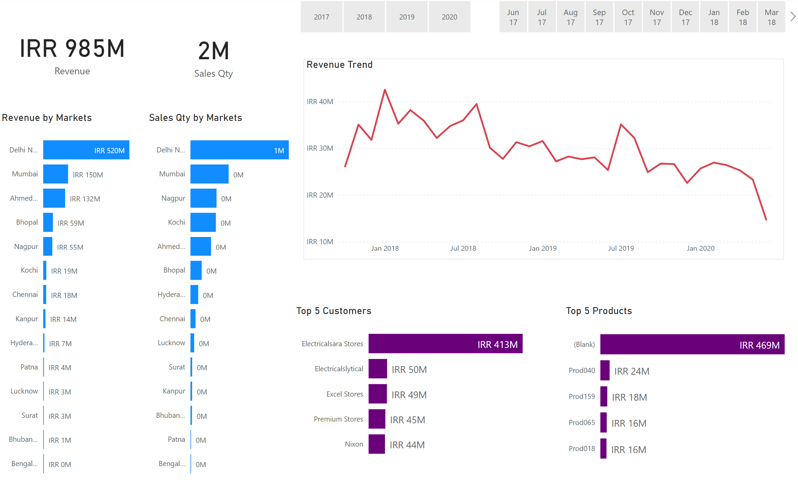
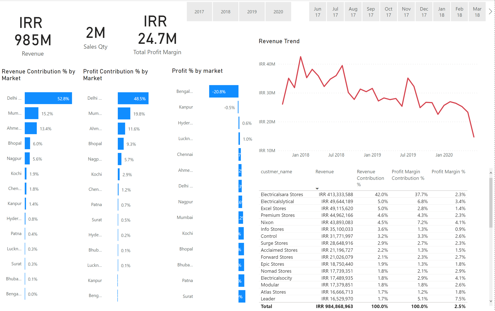
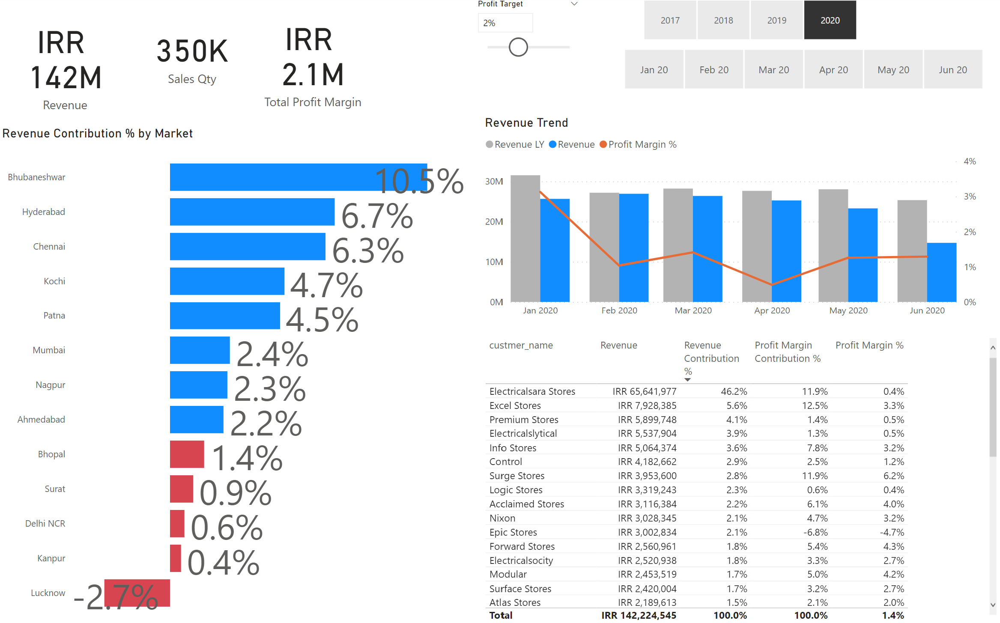

# DataAnalysis PowerBI sale insight
MySQL DATABASE
POWER BI
- Profit Margin.
- Revenue.
- Sale Qty.
- Revenue/year
- total profit margin 
- ...

# Key Insights
- Revenue
- Sales Qty
- Sales Qty by Market
- Revenue Qty by Market
- Filter by year and month
- top 5 Customers and Products
 
# Profit Analysis
- Analysis Profit by Market
- Revenue Contribution by market
- Revenue Trend
- Table 
 
# Performance Insights
- Filter a profit Target 
- Revenue Comparison with Revenue Last Year
- Table 
 
